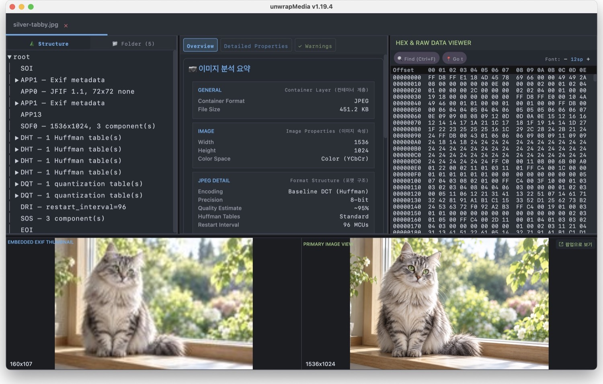
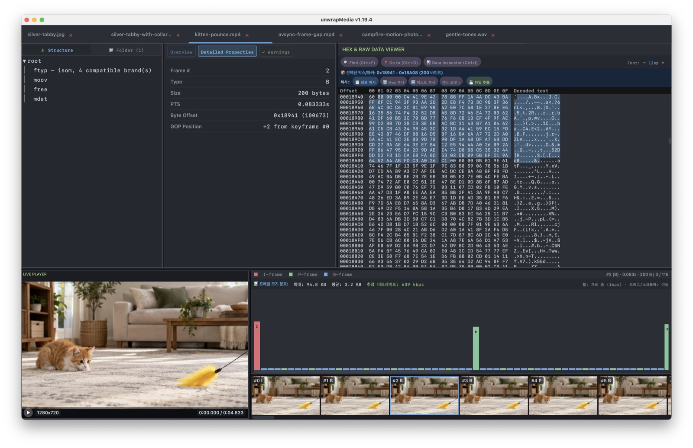
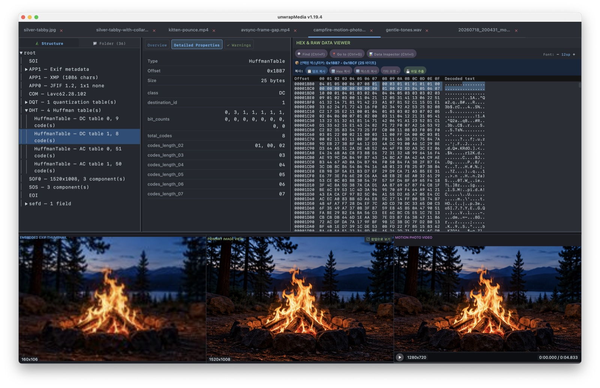
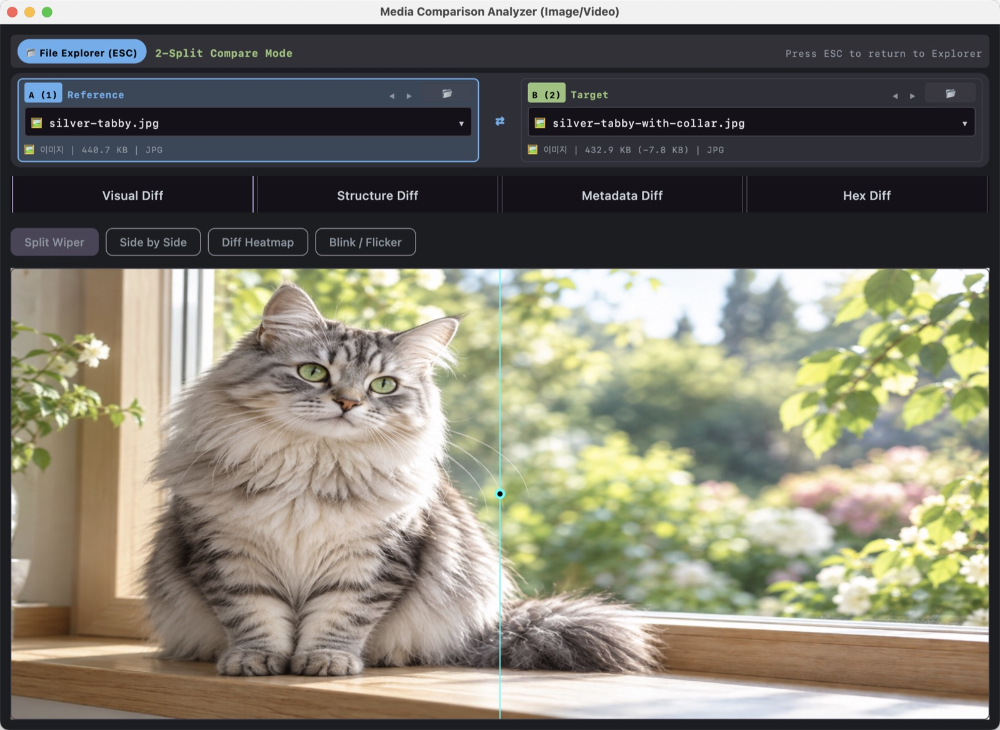
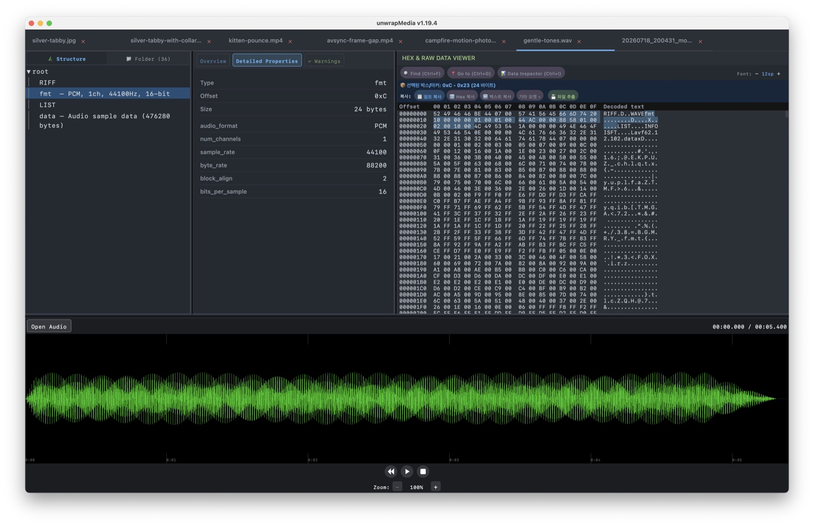
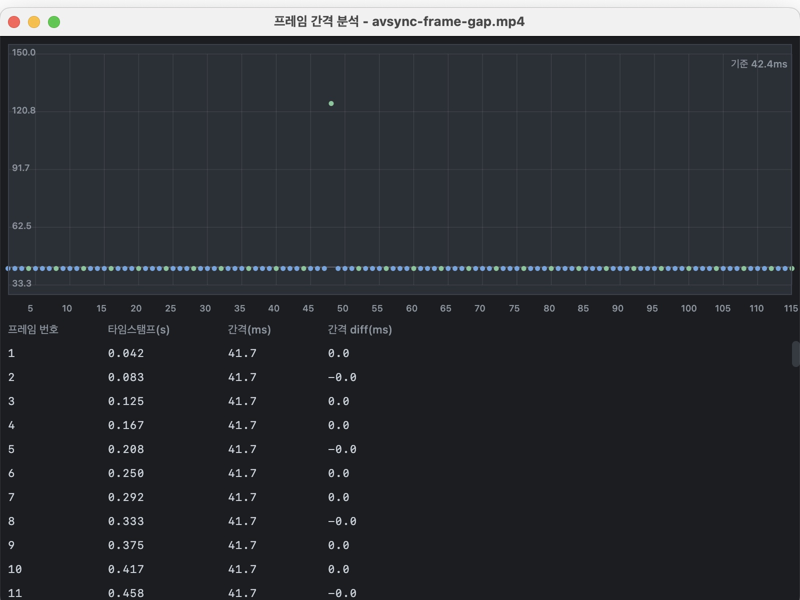
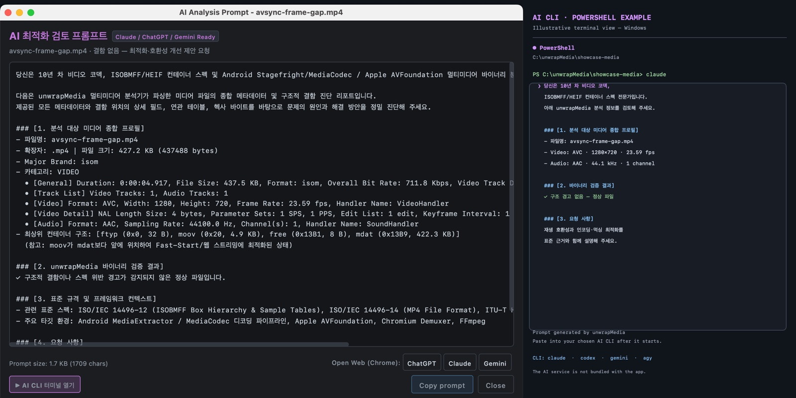

**언어:** [English](README.en.md) | 한국어

# unwrapMedia

**unwrapMedia**는 데스크톱 미디어 뷰어이자 포렌식 분석 도구입니다. 이미지·동영상·오디오를 재생하고, 컨테이너 구조와 메타데이터, 바이트 데이터를 함께 살펴볼 수 있어 파일이 어떻게 구성되었는지 분석할 수 있습니다.

## 지원 포맷

| 분류 | 예시 |
|---|---|
| 이미지 | JPEG/JPG, PNG, GIF, WebP, AVIF, HEIC/HEIF, BMP, TIFF/TIF, 카메라 RAW (CR2, NEF, ARW, DNG; 메타데이터 및 내장 프리뷰 분석) |
| 비디오 컨테이너/파일 | MP4, MOV, M4V, WebM, IVF, AVI, FLV, WMV, ASF; 독립 AV1 및 APV 스트림 |
| 비디오 코덱 | AVC/H.264, HEVC/H.265, AV1, AV2 (Windows 재생), APV, VP8/VP9, Dolby Vision |
| 오디오 | WAV, MP3, M4A, AAC, FLAC, OGG, Opus, AIFF/AIF/AIFC, WMA, Raw PCM |
| Raw 픽셀 | RAW, RGB, RGBA, YUV, NV12, NV21 |

코덱 재생과 분석 가능 여부는 컨테이너, 스트림 프로파일, 사용 가능한 디코더에 따라 달라집니다. 현재 AV2 재생은 Windows 전용입니다.


## 미디어 재생과 분석(파싱)

### 이미지 뷰잉 및 분석

이미지를 보면서 컨테이너 구조, EXIF·카메라 메타데이터, 크기와 색상 정보를 확인할 수 있습니다. JPEG에 EXIF 내장 썸네일이 있으면 원본 이미지와 나란히 표시합니다. 게인맵·HDR 도구로 최신 이미지 포맷과 보조 이미지도 살펴볼 수 있습니다.

gainmap 관련 기능 제공 - gainmap 이미지 뷰잉, gainmap 이미지 추출, gainmap xmp 보기, gainmap metadata 보기, 파일내 모든 xmp 정보

<p align="center">
  
</p>

### 동영상 재생 및 프레임 분석

동영상을 재생하면서 컨테이너와 코덱 정보를 확인할 수 있습니다. 프레임 분석은 프레임 종류와 크기를 시각화하고, 필름스트립에서 원하는 프레임을 빠르게 찾아 이동할 수 있게 합니다.

<p align="center">
  
</p>

샘플 영상은 [kitten-pounce.mp4](docs/showcase-media/video/kitten-pounce.mp4)입니다. 아래 움직이는 미리보기에서 필름스트립이 표현하는 동작을 볼 수 있습니다.

<p align="center">
  
</p>

### 모션포토 재생 및 분석

삼성·구글 방식의 모션포토를 감지해 스틸 이미지와 내장 동영상을 확인하고, 재생·추출·분석할 수 있습니다. 샘플은 실제 JPEG 안에 영상 세그먼트를 포함한 캠프파이어 모션포토입니다.
모션포토 overview 정보 보기, 모션포토 동영상 추출, 모션포토 미리보기 재생용 (MotionPhoto_AutoPlay SEF) 비디오 추출, 모션포토 동영상 프레임 드랍 분석, 모션포토 정합성 검사, 모션포토 포맷 생성(정적 이미지와 동영상을 결합하여 모션포토 포맷으로 생성)


<p align="center">
  
</p>

[campfire-motion-photo.jpg](docs/showcase-media/images/campfire-motion-photo.jpg) 또는 [분리된 영상](docs/showcase-media/video/campfire-motion.mp4)을 열어보세요.

아래 애니메이션은 모션포토에 내장된 영상의 미리보기입니다.

<p align="center">
  
</p>

### 미디어 비교 분석

두 파일의 시각적 픽셀 차이, 메타데이터, 컨테이너 구조, 바이트 단위 차이를 비교할 수 있습니다. 동영상 화질 비교 도구는 VMAF, PSNR, SSIM 등의 지표를 제공합니다.

<p align="center">
  
</p>

[고양이 비교 샘플](docs/showcase-media/images/)은 거의 같은 이미지 두 장으로 구성되어 있으며, 두 번째 이미지에만 청록색 목걸이와 방울이 있습니다. 두 파일을 연 다음 **Tools → Compare Files**를 선택하면 비교 분석기에서 픽셀 차이를 확인할 수 있습니다.

### 오디오 재생 및 분석

오디오를 들으며 메타데이터와 파형을 분석할 수 있습니다. 플레이어에서 탐색·확대/축소를 지원하고, 지원되는 오디오 레이아웃에서는 채널 제어도 가능합니다.

<p align="center">
  
</p>

생성한 [gentle-tones.wav](docs/showcase-media/audio/gentle-tones.wav)를 재생해 보세요.

## RAW Viewer 지원
RAW, RGB, RGBA, YUV, NV12, NV21

## audio PCM 재생 지원


## 이슈 분석 및 파일 진단

### A/V 싱크 및 프레임 드랍 분석

A/V 싱크 분석기는 오디오·비디오 프레젠테이션 타임라인을 비교해 오프셋과 재생 시간 차이를 조사합니다. 프레임 간격 분석은 타임스탬프 간격을 시각화해 불규칙한 타이밍이나 프레임 드랍 가능성을 살펴봅니다. 진단 결과는 분석 근거이며, 캡처 단계의 모든 프레임 손실을 확정하는 것은 아닙니다.

<p align="center">
  
</p>

[avsync-frame-gap.mp4](docs/showcase-media/video/avsync-frame-gap.mp4)는 두 기능을 시험하기 위한 합성 샘플입니다. 의도적인 오디오 지연과 비디오 타임스탬프 간격이 포함되어 있습니다. 자세한 내용은 샘플 미디어 설명을 확인하세요.

### 비트스트림 결함 및 손상 분석
동영상내 비트스트림 뭉개짐, 비트스트림 에러로 인한 이슈 발생시 사용하기 위한 기능, 이슈 발생시에 실질적으로 쉽게 도움을 받을수있도록 더 보완해야함


### 파일내 모든 SEF 에 대한 무결성 검사 
올바르게 구성되어있는지 검사, sef header, sef tail, sef header 정보에 따른 실제 sef data 위치와 length 


### AI 보조 진단

구조 검사는 파서가 감지한 경고를 보여주며, AI 프롬프트 생성 기능은 파일별 기술 정보를 정리해 외부 AI 도우미에 전달할 수 있게 합니다. unwrapMedia가 프롬프트를 만들며 AI 서비스를 내장하거나 요구하지 않습니다. Windows에서는 프롬프트 창에서 PowerShell을 앱 안에 열 수 있습니다. 화면 오른쪽 터미널은 실제 Windows 캡처가 아닌 PowerShell 사용 흐름 예시입니다.

<p align="center">
  
</p>


CLI 예시:

```bash
unwrapMedia dump <file>              # 파싱된 구조를 JSON으로 출력
unwrapMedia check <file>             # 구조 경고 검사
unwrapMedia check <file> --prompt    # AI 진단 프롬프트 생성
unwrapMedia check <image>            # 이미지: 구조 무결성 검사 결과(imageIntegrity) 포함
unwrapMedia check <image> --decode   # 이미지: FFmpeg + Skia 디코딩 검사까지 실행
unwrapMedia check <file> --case report.json  # 재현용 분석 케이스 저장(미디어 원본 제외)
unwrapMedia check <video> --decode --case report.json  # 디코딩 검사와 패킷 매핑 포함
```

분석 케이스에는 파일명, 크기, SHA-256, 미디어 요약 및 오프셋이 포함된 경고가 저장됩니다. 로컬 절대 경로, 원본 미디어, 썸네일, GPS 위치 정보는 포함하지 않으며 기존 출력 파일을 덮어쓰지 않습니다.

동영상은 **분석 → 영상 무결성 검사…**에서 검사를 시작하거나 취소할 수 있습니다. 디코딩 검사 탭은 첫 번째 영상 트랙의 소프트웨어 디코딩 결과와 오류 로그를, 패킷 매핑 탭은 PTS/DTS·파일 오프셋·크기·키프레임 여부를 표시합니다. 패킷을 선택하면 메인 Hex 뷰어에서 해당 바이트 범위를 강조합니다. 검사 결과는 분석 케이스 JSON으로 저장할 수 있습니다.

기존 ‘비트스트림 결함 및 손상 프레임 정밀 분석’ 메뉴는 이 화면으로 통합되었습니다. 기존 단축키와 오류 해설을 제공하며, 가능한 원인·영향은 추정으로 표시합니다. 디코더 오류의 바이트 위치는 ‘위치 미확인’으로 표시하고 임의의 프레임과 연결하지 않습니다. 해설과 위치 확인 상태는 JSON의 `diagnostics`에도 저장됩니다.

`--decode`는 FFmpeg/FFprobe가 필요하며 오디오 및 모든 코덱 구문의 독립적인 정합성 검사를 포함하지 않습니다. 각 단계는 최대 30분, 저장되는 패킷은 최대 100,000개, 로그는 단계별 최대 2,000줄로 제한되며 생략 여부를 기록합니다. 검사 실패·중단은 정상 완료와 구분됩니다. 디코더 로그의 정확한 오류 패킷 위치는 확정하지 않으며, `--decode` 없이 저장한 케이스에는 `NOT_RUN`이 기록됩니다. 기존 `warningCount`는 구조 경고 수이고 디코딩 결과는 `videoIntegrity`에서 확인합니다.

이미지는 **분석 → 이미지 무결성 검사…**에서 포맷별 구조 검사(JPEG SOI/EOI·세그먼트 순서, PNG 청크 CRC·IEND, HEIF iloc 범위·그리드 타일, WebP RIFF 크기, GIF 트레일러, BMP 픽셀 배열 크기, TIFF/RAW IFD 순환·스트립 범위)와 FFmpeg·Skia 디코딩 검사를 실행합니다. 구조 검사 결과는 오프셋을 가지며 클릭하면 Hex 뷰에서 강조됩니다. 두 결과는 합치지 않고 나란히 표시합니다. FFmpeg는 잘린 JPEG를 경고 한 줄(`overread`)만 남기고 종료코드 0으로 끝내는 경우가 있어, 더 엄격한 Skia 디코더 결과를 함께 표시합니다. RAW 파일은 센서 데이터 대신 내장 JPEG 프리뷰만 디코딩합니다. 모션포토(삼성 SEF·구글 XMP·HEIC mpvd)가 감지되면 같은 창의 **모션포토** 탭에서 내장 영상까지 검사합니다. CLI `check` JSON에는 모션포토가 감지될 때마다 `motionPhoto`가 포함되며, `--decode`를 주면 내장 영상까지 전체 분석하고 그렇지 않으면 `"status": "NOT_RUN"`으로 표시됩니다. 구조에서 모션포토가 감지되었지만 분석기가 어떤 포맷도 확인하지 못하면 `motionPhoto`가 `"status": "SKIP"`이 될 수 있습니다.

## 라이선스

MIT — [LICENSE](LICENSE)를 참고하세요.
